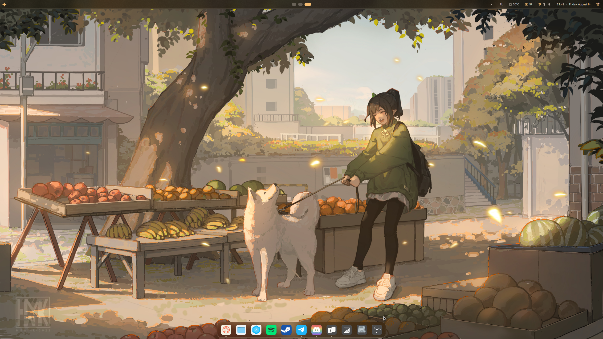

# Fedora Notes

Fedora Notes — це моя особиста база нотаток про Fedora Linux. Тільки реальний досвід: тут я фіксую проблеми, з якими зіштовхнувся під час використання системи, та способи їх вирішення.

Ділюся цими нотатками з вами — сподіваюся, вони допоможуть заощадити час і зберегти нерви!

<figure><figcaption></figcaption></figure>


Цей ресурс є незалежною особистою базою знань. Він не є офіційною документацією та не пов'язаний з Red Hat Inc. або Fedora Project.



Якщо ці нотатки стали вам у пригоді й ви хочете подякувати автору, ви можете пригостити мене кавою на [Buy Me a Coffee](https://www.google.com/url?sa=E\&source=gmail\&q=https://buymeacoffee.com/arisadev13w). Дякую за підтримку!


